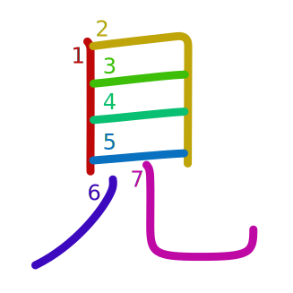
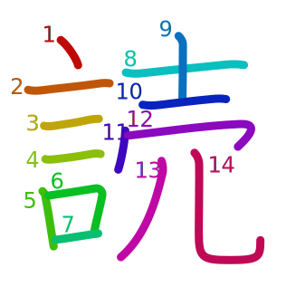
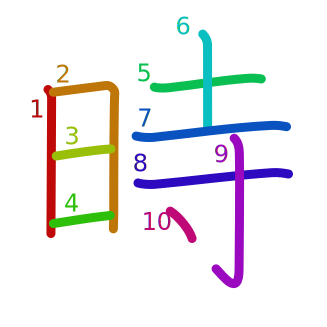
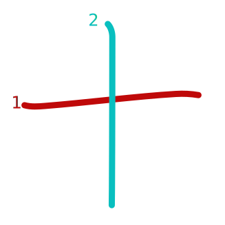
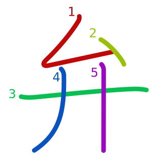
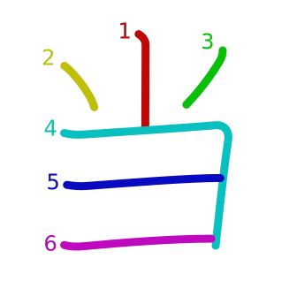
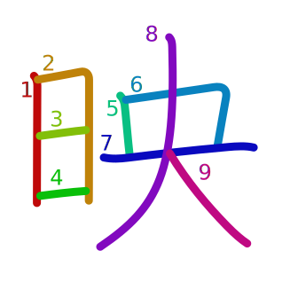

# Vocabulary 

## [テレビ](../../Vocabulary/テレビ.md)
## [映画](../../Vocabulary/映画.md)
## [よく](../../Vocabulary/よく.md)
## [バスケットボール](../../Vocabulary/バスケットボール.md)
## [時々](../../Vocabulary/時々.md)

## [サッカー](../../Vocabulary/サッカー.md)
## [ジャズ](../../Vocabulary/ジャズ.md)
## [ロック](../../Vocabulary/ロック.md)
## [音楽](../../Vocabulary/音楽.md)
## [ニュース](../../Vocabulary/ニュース.md)

## [Vocabulary/Nouns/本](Vocabulary/Nouns/本)
ほん

## [雑誌](../../Vocabulary/雑誌.md)
## [する](../../Vocabulary/する.md)
## [野球](../../Vocabulary/野球.md)
## [アニメ](../../Vocabulary/アニメ.md)
## [漫画](../../Vocabulary/漫画.md)
## [ポップ](../../Vocabulary/ポップ.md)
## [サンドイッチ](../../Vocabulary/サンドイッチ.md)
## [パン](../../Vocabulary/パン.md)
## [毎日](../../Vocabulary/毎日.md)
## [毎朝](../../Vocabulary/毎朝.md)
## [毎晩](../../Vocabulary/毎晩.md)
## [ジュース](../../Vocabulary/ジュース.md)
## [コーヒー](../../Vocabulary/コーヒー.md)
## [食べる](../../Vocabulary/食べる.md)
## [Vocabulary/Nouns/時](Vocabulary/Nouns/時)
## [朝ご飯](../../Vocabulary/朝ご飯.md)
## [昼ご飯](../../Vocabulary/昼ご飯.md)
## [晩ご飯](../../Vocabulary/晩ご飯.md)
## [Vocabulary/Nouns/十](Vocabulary/Nouns/十)

## [十一](../../Vocabulary/十一.md)
## [十二](../../Vocabulary/十二.md)
## [弁当](../../Vocabulary/弁当.md)
## [Vocabulary/Nouns/八](Vocabulary/Nouns/八)
## [Vocabulary/Nouns/九](Vocabulary/Nouns/九)
## [Vocabulary/Nouns/半](Vocabulary/Nouns/半)

# Kanji
## 見
See/Look
み
 

## 読
Read
よ

## 時
Time/O'Clock
じ
とき

## 十
Ten
じゅう

## 八
## 半
## 九
## 弁
Speech/dialect

## 当
Accurate 

## 映
日 (sun, day) + 央 (central) 
Project/reflect

## 画
## 昼
## 時
## 晩
## 朝
## 本
## 毎
## 漫
## 読
## 野
## 球
## 雑
## 誌
## 音
## 楽
## 食
